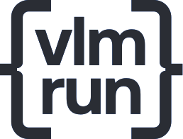

     

<h2>VLM Run</h2>
  The Unified Gateway for Visual AI

<a href="https://docs.vlm.run"><b>Website</b></a> | <a href="https://app.vlm.run/"><b>Platform</b></a> | <a href="https://docs.vlm.run/"><b>API Docs</b></a> | <a href="https://docs.vlm.run/blog"><b>Blog</b></a>

At [VLM Run](https://vlm.run), we're building the Unified Gateway for Visual AI—an end-to-end platform that enables enterprises to seamlessly process and extract value from unstructured visual data. Our inference APIs allow businesses to harness the power of modern Vision-Language Models (VLMs) to accurately extract structured data (JSON) from diverse visual sources like images, videos and documents, acting as ETL for any visual content.

#### 🔗  Quick Links

* 💬 Send us an email at [support@vlm.run](mailto:support@vlm.run) or join our [Discord](https://discord.gg/4jgyECY4rq) for help.
* 📣 Follow us on [Twitter](https://x.com/vlmrun), and [LinkedIn](https://www.linkedin.com/company/vlm-run) to keep up-to-date on our products.
